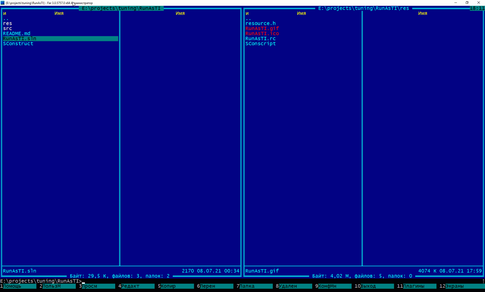
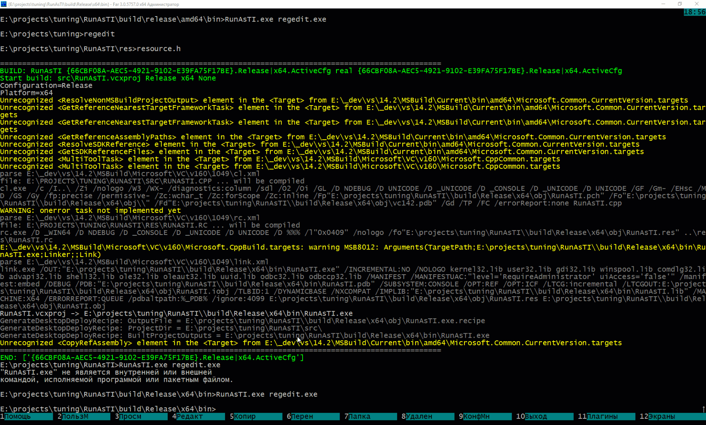

# Run as TrustedInstaller
This tool can be used to run various programs and utilities on behalf of TrustedInstaller. A distinctive feature of most analogs is the copying of environment variables and the path from which the utility is launched.

## Usage example
1. Case - no arguments (run cmd.exe):
```
RunAsTI.exe
```

2. Case - run any aplication (for exaple regedit.exe) :
```
RunAsTI.exe regedit.exe
```

3. Case - run any python script (of couse with current envinronment and path):
```
RunAsTI.exe python.exe -c "import os; os.system('whoami /all | find \"Trusted\"'); import time; time.sleep(5)"
```

